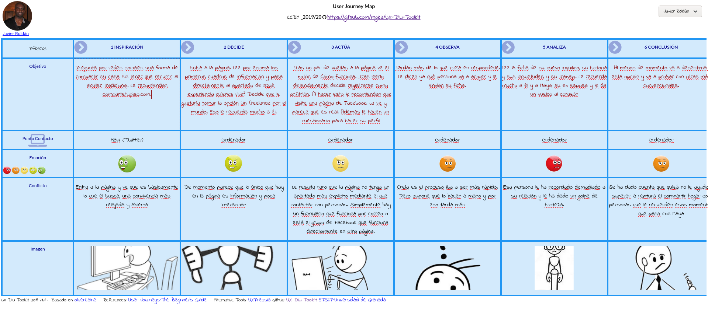

# DIU - Practica1, entregables

## Desk research: Análisis de Competencia
Nuestro grupo se encargará de analizar sitios web dedicados a la compartición de viviendas por diferentes métodos.

En mi caso he escogido [compartetupiso.com](https://www.compartetupiso.com/) porque me pareció un sitio muy elegante, con una disposición de los contenidos muy bonita y simple. Leyendo un poco la página observé que se trataba de una forma de convivencia distinta y eso me llamó la atención así que quería ver qué ofrecía esta página y analizrlo con algo más de detalle.

Este portal funciona de modo que tu te inscribes a una lista de personas que, o bien ofrecen su vivienda o bien necesitan alojarse. Una vez inscrito, te contactan para que respondas una serie de preguntas que servirán para encajarte en un perfil. Una de ellas incluye el tipo de convivencia que prefieres de entre los que ofrecen.

Finalmente te contactan con las diferentes opciones que han encontrado.

Todo esto lo manejan personas, la página es un mero escaparate para contarte de qué va el asunto y registrarte.

Es bastante diferente con respecto a su competencia, si es que la podemos llamara como tal porque no considero que tenga copetencia directa con el formato
que ofrece.

He decidido analizar *Compartetupiso* frente a otras como *Badi* o *Couchsurfing* **simplemente** porque me pareció más bonita y directa. Además, en Couchsurfing la
página de portada es la de registrarse y eso me parece bastante poco amigable de cara a nuevos usuarios ya que no hay ninguna guía visual de en qué tipo
de página te estás registrando.

## Personas

<pre>	Por un  lado he escogido a Javier Roldán.
Me parecía interesante concebir una persona que es
alegre y confiable pero que su vida no es una utopía
y se divorció de su pareja. Así que necesita algo
de compañía para superarlo y compartir su casa parece,
a priori, una buena idea.</pre>

### Más sobre Javier:
Javier es un hombre de 45 años que nació en Madrid. Su madre, una inmigrante cubana se enamoró de un español y tuvieron juntos a Javier. Desde
pequeño recibió insultos por ser negro, pero a él no le importaba, tenía bien enseñado que eso no es algo por lo que avergonzarse ni le
hacía inferior. No era caprichoso y sí formal en la escuela. Sin embargo, algo que siempre le pedía a sus padres era algo de dinero para comprar
alguna que otra revista al kiosko. Le encantaba pasear, llegar al kiosko, comprar la revista com más fotos de naturaleza que encontraba y compartirla
con sus amigos en el parque. Le fascinaba ver todos aquellos paisajes tan bonitos, pensar que corría por los bosques o escalaba las montañas.
Cada vez que había excursion a la sierra de Madrid lo gozaba como ninguno y de vez en cuando se quedaba mirando fijamente a los paisajes.

Ya en el instituto decidió que él quería ser fotógrafo e inmortalizar los mejores paisajes de modo que, una vez acabó éste (sin mayor esfuerzo),
entró en la carrera de comunicación audiovisual y se especializó en fotografía. Durante la carrera, en el segundo año, conoció a Maya, una chica que
compartía sus ganas de viajar y fotografiar recónditos rincones del mundo.

Poco después de acabar la carrera, con 25 años, se casaron. Todo iba bien y mientras ella encontró trabajo en una empresa importante, él decidió
llevar un blog de viajes centrado en descubrir la naturaleza. Poco a poco su estilo de fotografía fue derivando en una fotografía más práctica para
el estudio científico. Fotografiaba animales y plantas de forma que parecía un documental.

Ya con 40 años se fijó en él una revista científica española que habla mucho sobre biología. Aceptó el trabajo incluso sabiendo que iba a tener que estar
la mayor parte del tiempo en España, alejado de Maya. Él quiso dar este paso para plantearle a ella asentarse y tener una vida menos nómada, menos ajetreada
y formar una familia. Por desgracia para él, ése nunca fue el plan de Maya y su matrimonio, en esas condiciones, no duró más de 2 años.

Fue muy duro para ambos, pero sus planes ya no iban por la misma dirección y ninguno podía obligar al otro a intentar ajustar esos planes. Era demasiado
egoísta.

Así que ahí está Javier, superando la ruptura en la casa que compró para que vivieran ambos y formaran una familia.

<pre>	Por otro lado se me ha ocurrido el perfil de Alba Moreno.
Una recién graduada que acaba de encontrar trabajo
 y resulta que es a distancia. Eso le da libertad
de alojamiento e ingresos. Ella ha querido viajar
por España desde hace mucho y ahora le parece un
momento muy propicio.
</pre>

### Más sobre Alba:
Ella es una chica de 24 años que nació en Fuzhou, China. Sus padres la dieron en adopción tras nacer porque no se podían hacer cargo de ella. Tuvo
la suerte de que la familia Moreno Gascó la adoptara siendo aún un bebé.

Uno de sus papás es físico y siempre tuvo en casa un ordenador y algún que otro cacharro electrónico. Ellos nunca le prohibieron que los usara
y se despertó en ella un interés muy fuerte haci la tecnología. Ya en instituto empezaron utilizar ordenadores en clase y, de hecho, incluso les
dieron uno a cada uno en forma de préstamo para el curso. Ese ordenador que venía con un sistema operativo libre, Lliurex, le hizo trastear e
interesarse definitivamente por la informática. Por supuesto, no sólo se dedicaba a los estudios y la informática, también le gustaba quedar con
sus amigos para charlar, ver películas y, de vez en cuando, jugar al basket.

Cursó el bachillerato científico-tecnológico y entró sin problemas en el grado de Ingería Informática de la UPV. Allí desarrolló especial interés
por todo lo relacionado con los sistemas operativos y su gestión. Además se aficionó bastante a salir en bicicleta y el cine gracias a un grupo
de amigos a los que le encantaba quedar para hacer esto.

Recientemente ha terminado el grado y se ha especializado en sistemas. Y hace muy poco la han contratado en una empresa alemana en la que puede
trabajar a distancia.

## User Journey Maps
Quería que una de las experiencias fuera negativa porque así ha sido mi primer contacto con la página. Pero no es una mala experiencia al usar la página
en sí, sino más bien por motivos personales. Es decir, he querido reflejar que la convivencia bajo ciertas circunstancias suponga un problema para alguien.

Sin embargo puedo entender que haya personas más ávidas en lo que ofrece esta página y que la entinedan a la primera. Así que, Alba, con su personalidad más decidida, enseguida consigue usarla y sacarle provecho.

## Revisión de Usabilidad

La revisión completa se encuentra [aquí](Usability-review.xlsx).

Ha obtenido un apuntación numérica de 80 puntos.

La página tiene un diseño bonito, limpio y conciso. Las cosas principales que necesitas saber de la página ya las tienes en la portada.
Registrarse, consultar el blog y contactar con el personal es muy fácil y está muy a mano. Tembién ayuda que no tiene ningún apartado
interactivo ni ningún mecanismo complicado. Es principalmente información, un escaparate para esta iniciativa de convivencia diferente.

Como no hay acciones complejas, la página no se ensucia con nada y se entra mucho en maquetar la información de una forma simple.

Realmente esta página no tiene mucho más de donde sacarle jugo. Por ese lado es un poco decepcionante al principio ya que uno espera
poder interactuar con personas o ver lugares para alojarse en la propia página pero lueog te das cuenta de que eso lo manejan aparte
personas. Al menos eso queda claro tras leerte la infomación de la página y, sobre todo, tras registrarte.
