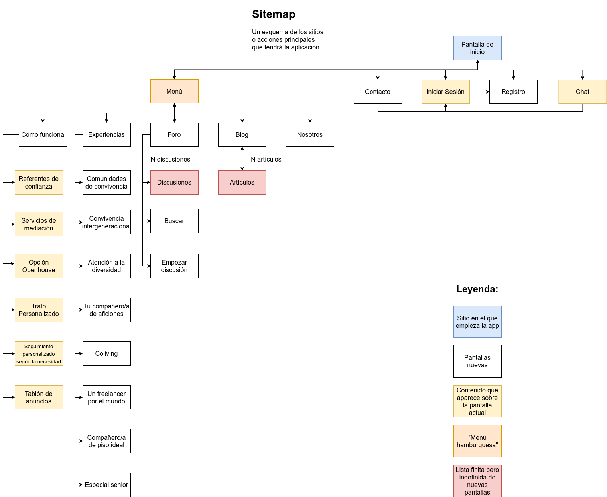

# DIU - Practica2, entregables

Para esta práctica debemos empezar ya el diseño de una aplicación de móvil basándonos en la página que escogimos en la práctica anterior. En mi caso se trata de *[compartetupiso.com](https://compartetupiso.com)*.

A continuación se desglosan los pasos a seguir para las primeras etapas de desarrollo del diseño.

## Malla receptora de información

Puedes encontrar el documento [aquí](Malla-receptora.pdf).

En este documento se procurá recoger información del diseño de la página que ya existe e intentar mejorarlo mediante las preguntas de nuestras personas y nuevas ideas que tengamos para la aplicación.

#### Cosas interesantes que conservar

Sobre todo, la forma en que se presenta la información es muy limpia y profesional así que la mayor parte de las zonas con información prinicpal las conservaremos y las trasladaremos al formato móvil.

#### Críticas

En general es poco interactiva y, para ser una página de convivencia, no hay comunicación directa con otras personas a no ser que entres al grupo de Facebook. Vamos a intentar que haya más interacción interpersonal y que la versión de aplicación no dependa de Facebook. Eso sería bastante desagradable en una aplicación.

#### Preguntas

¿Dónde están los pisos? ¿Cómo sé que esto funciona como dice? ¿Dónde subo mi casa?

Son preguntas que uno se hace al ver un sitio que es diferente, no es un escaparate de pisos para alquilar como cientos de otras páginas y eso hay que dejarlo bien claro. Además, exponer testimonios de otras personas que hayan probado este sistema sería muy iluminador.

#### Nuevas ideas

Poner un pequeño reportaje con experiencias reales para que se vea que realmente hay personas detrás de esto y compartiendo experiencias ayudaría a reforzar la credibilidad.

Mejorar la comunicación interpersonal con un foro puede ser clave.

## Tabla Usuarios / Tareas

El documento lo puedes encontrar [aquí](Tabla_usuarios-tareas.pdf)

Para la forma de analizar la importancia de las tareas hemos elegido la tabla *Ususarios / Tareas* ya que, aunque queremos aumentar la interactividad, no va a haber mucha, ni las tareas van a ser muy complejas como para hacer un *task flow*.

Pero sobre todo esta tabla permite visualizar que, si bien es importante informar directamente con texto al usuario, hay que darle importancia a que tenga métodos más personales de obtener esa información como, por ejemplo, discutiendo con otros usuarios en un foro o hablando directamente con el personal de apoyo mediante un chat específicamente diseñado para ello. También puede dar lugar a que se resuelvan antes las dudas del usuario y hacer que decida seguir confiando en la iniciativa.

Hemos decidido agrupar los usuarios únicamente en *Inquilinos* y *Anfitriones* porque, independientemente de tu perfil o de tu personalidad, en esta aplicación, hay dos grupos de usuarios con intereses comunes. Los que van a aportar su casa y los que necesitan una casa.

Hay que procurar hacer la información accesible a aquellos grupos de usuarios que están menos familiarizados con el entorno digital y así nos aseguramos que será accesible para los demás. Al menos, en este tipo de aplicación, eso es suficiente.

## Sitemap

En este caso el documento es una imagen, así que la podemos ver directamente aquí:

Es bastante autoexplicativo. Pero cabe mencionar que no sólo he tenido en cuanta qué sitio lleva a cual sino que ya he anticipado qué sitio será una pantalla nueva de la aplicación y que sitio puede ser un elemento flotante. Y, para agilizar, algunas etiquetas representan a un conjunto de etiquetas.

[Pincha aquí](Sitemap.png) para ver la imagen original

## Labelling

Pincha [aquí](Etiquetado.pdf) para verlo.

También se explica solo. Explica el significado de las etiquetas que se han usado. Prácticamente todas se traducirán a botones en la aplicación.

## Bocetos Lo-Fi

Se trata de una serie de esquemas que definen la disposicion general de la inforación en las distintas pantallas de la aplicación. Hay elementos comunes como el logo, que siempre llevará a la pantalla de inicio, el *menú hamburguesa* que recoge la mayoría de sitios a los que se puede acceder y los botones de iniciar sesión y registrarse que se cambiarán por tus datos de usuario cuando inicies sesión.

Tambien he añadido, de forma un poco escueta, la relación entre pantallas, con lo que también podemos considerarlo un *task flow*.

[Este documento](Bocetos.pdf) contiene todos los bocetos en orden, pero con menos calidad que las fotografías originales que encontrarás en la [siguiente carpeta](imagenes/bocetos_lo-fi).

Pero dado que son imágenes, las adjunto a continuación:

