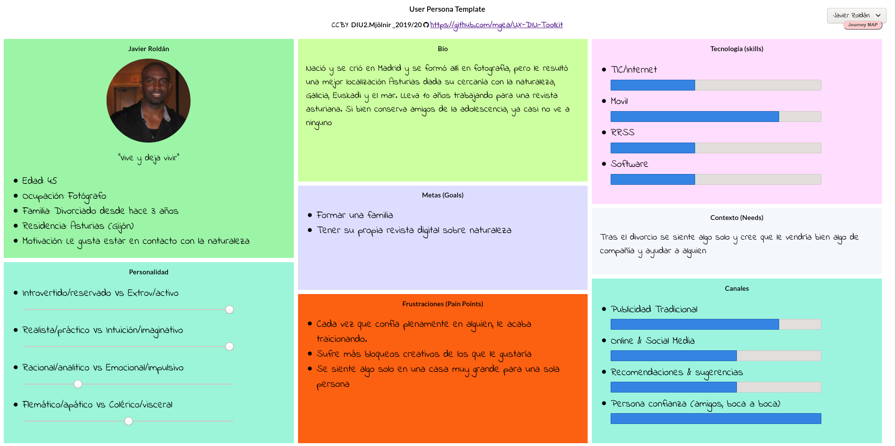
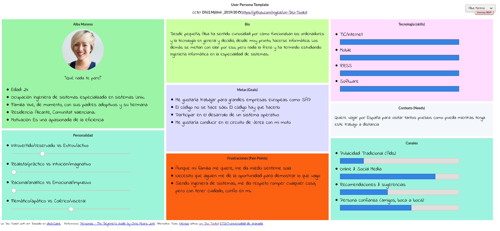
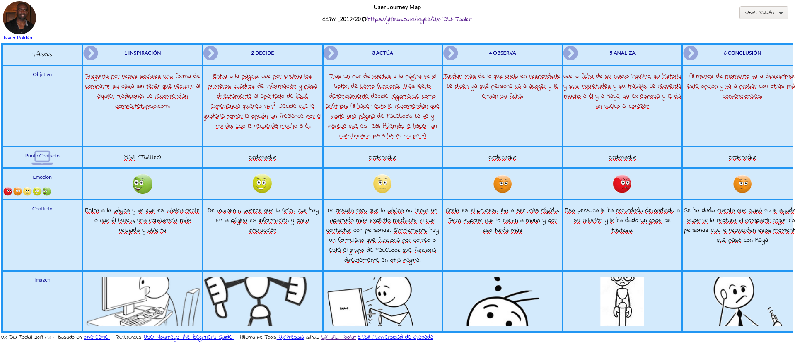
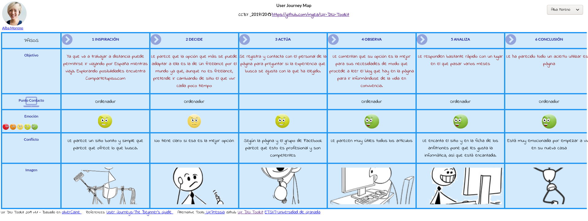
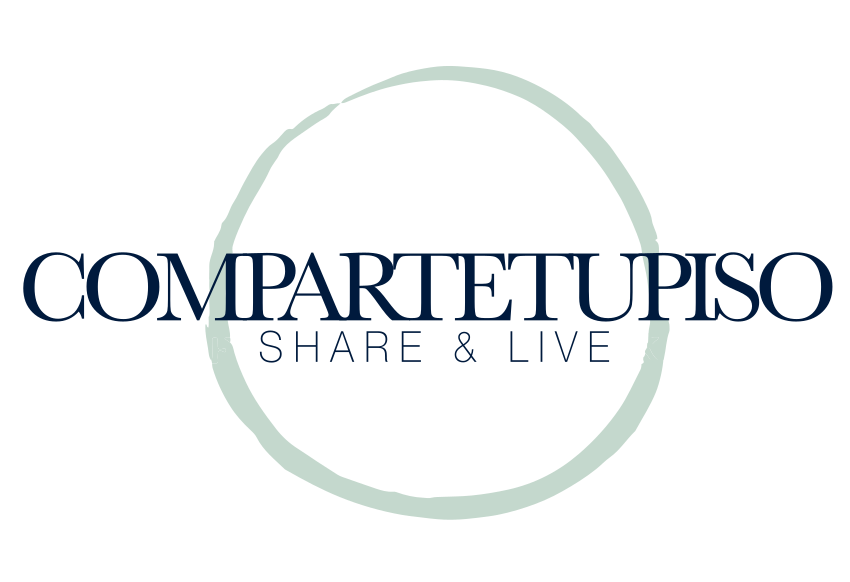

# DIU20
Prácticas Diseño Interfaces de Usuario 2019-20 (Economía Colaborativa)

Grupo: DIU2_Mjölnir.  Curso: 2019/20

Proyecto:
>>> App para Compartetupiso

Descripción:

>>> Es una aplicación movil que comparte funciones con la página web de [Compartetupiso.com](https://compartetupiso.com) y añade algunas como el chat de soporte o el foro.

Logotipo:

>>> (Se mantendría el original)

Miembros
 * :bust_in_silhouette:   Darío Megías Guerrero     [:octocat:](https://github.com/Nintwarr)

-----

>>> En esta práctica estudiaremos un caso de plataforma de economía colaborativa y realizaremos una propuesta para su diseño Web/movil. Utilizaremos herramientas y entregables descritos en el siguiente CheckList (https://github.com/mgea/UX-DIU-Checklist) Elimine este texto desde la práctica 1

Qué es economia colaborativa: Martínez-Polo, J. (2019). **El fenómeno del consumo colaborativo: del intercambio de bienes y servicios a la economía de las plataformas**, *Sphera Publica, 1*(19), 24-46. http://sphera.ucam.edu/index.php/sphera-01/article/view/363/14141434

# Proceso de Diseño

## Paso 1. UX Desk Research & Analisis

 1.a Competitive Analysis
-----

>>> *Describe brevemente características de las aplicaciones que tienes asignadas, y por qué has elegido una de ellas (150-300 caracteres)*

Nuestro grupo se encargará de analizar sitios web dedicados a la compartición de viviendas por diferentes métodos.

Yo he escogido [compartetupiso.com](https://www.compartetupiso.com/) **simplemente** porque me pareció la más bonita y más simple. Ofrecía algo diferente
sin competencia directa y eso me atrajo. No he encontrado nada parecido con lo que compararla.

 1.b Persona
-----

>>> *Comenta brevemente porqué has seleccionado a esas personas y sube una captura de pantalla de su ficha  (80-150 caracteres)*

Por un  lado he escogido a Javier Roldán, un hombre de 45 años recién divorciado que necesita compañía.

Por otro lado se me ha ocurrido el perfil de Alba Moreno, una joven con ganas de viajar pero poco dinero.

Para saber más sobre estas personas, vaya [aquí](P1#Personas)

 1.c User Journey Map
----

>>> *Comenta brevemente porqué has escogido estas dos experiencias de usuario (y si consideras que son habituales) (80-150 caracteres)*

Quería tener una mala experiencia que no dependiera directamente de la página.

Y otra experiencia plenamente satisfactoria.

 1.d Usability Review
----
>>>  Revisión de usabilidad: (toma los siguientes documentos de referncia y verifica puntos de verificación de  usabilidad
>>>> SE deben incluir claramente los siguientes elementos
>>> - Enlace al documento: [Aquí](https://github.com/Nintwarr/DIU20/blob/master/P1/Usability-review.pdf)
>>> - Valoración final (numérica): 80
>>> - Comentario sobre la valoración: Es una página sencilla, orientada a mostrar información y no a interactuar con ella. Por ello es capaz de mantenerse limpia y bonita.

## Paso 2. UX Design

 2.a Feedback Capture Grid
----

>>> Comenta con un diagrama los aspectos más destacados a modo de conclusion de la práctica anterior.

 Interesante | Críticas
| ------------- | -------
  Preguntas | Nuevas ideas

El documento completo está [aquí](P2#Malla-receptora-de-información).

>>> ¿Que planteas como "propuesta de valor" para un nuevo diseño de aplicación para economia colaborativa ?
>>> (150-200 caracteres)

Una forma más directa de comunicación entre los propios usuarios ayuda a reforzar el concepto de comprtir y ayuda a los usuarios a crear una comunidad de la que formar parte

 2.b Tasks & Sitemap
-----

>>> Definir "User Map" y "Task Flow" ...

Hemos querido hacer hincapié en que hay tareas que no se tenían en cuenta pero que realmente sí tienen peso. Las puedes ver en esta [tabla *Usuarios / Tareas*](P2#Tabla-Usuarios--Tareas).

En cuanto al sitemap, puedes verlo completo [aquí](P2#Sitemap).

 2.c Labelling
----

>>> Identificar términos para diálogo con usuario

Término | Significado
| ------------- | -------
  Login¿?  | acceder a plataforma

Se detalla en [este documento](P2#Labelling).

 2.d Wireframes
-----

>>> Plantear el  diseño del layout para Web/movil (organización y simulación )

Hemos hecho a mano una serie de bocetos *lo-fi* de las diferentes panatallas en formato aplicación móvil. Puedes verlos [aquí](P2#Bocetos-Lo-Fi).

## Paso 3. Mi equipo UX-Case Study

 3.a ¿Como se cuenta un UX-Case Study?
-----

>>> Analizar lo aprendido de la experiencia MuseApp

Es un IX-Case Study muy completo elaborado por un equipo profesional con un objetivo claro en mente. Pero, ¿es quizá demasiado extenso? [Esto pienso](P3#an%C3%A1lisis-de-musemap)

  3.b Logotipo
----

El logotipo que ya ofrece la página me parece muy adecuado

>>> Si diseña un logotipo, explique la herramienta utilizada y la resolución empleada. ¿Puede usar esta imagen como cabecera de Twitter, por ejemplo, o necesita otra?

 3.c Guidelines
----

El estilo de la página original es algo que quise conservar y mi meta es seguir un [estilo similar](P3#Propuesta-de-elementos-de-diseño-o-patrones-a-usar)

>>> Tras documentarse, muestre las deciones tomadas sobre Patrones IU a usar para la fase siguiente de prototipado.

  3.d Video
----

[Enlace al vídeo](https://youtu.be/wHdrWwJmTNI)

>>> Documente y resuma el diseño de su producto en forma de video de 90 segundos aprox

## Paso 4. Evaluación

 4.a Casos asignados
----

>>> Descripción de las asignaciones (3 UX Case Study) y enlace a  sus repositorios.

>>>> En la seccioón P4/readme.md se debe acceder además a sus respectivas hojas de evaluación y conclusiones

 4.b User Testing
----

>>> Seleccione a una de sus personas ficticias. Exprese las ideas de posibles situaciones conflictivas de esa persona en las propuestas evaluadas

. 4.c Ranking
----

>>> Concluya con un ranking de los casos evaluados

>>> Valoración personal

## Paso 5. Evaluación de Accesibilidad

  5.a Accesibility evaluation Report
----

>>> Indica qué pretendes evaluar (de accesibilidad) y qué resultados has obtenido + Valoración personal

>>> Evaluación de la Accesibilidad (con simuladores o verificación de WACG)

## Conclusión final / Valoración de las prácticas

>>> (90-150 palabras) Opinión del proceso de desarrollo de diseño siguiendo metodología UX y valoración (positiva /negativa) de los resultados obtenidos
